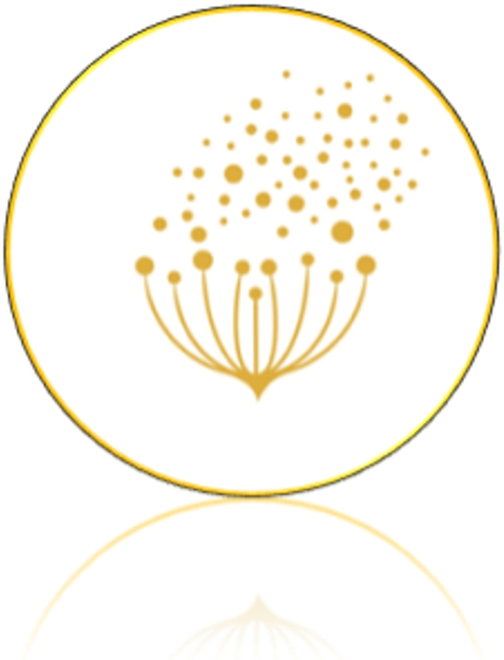

# PollenTrack

    

## Algorithme de prise de photo
Le problème majeur est de réussir à prendre une photo qui n’est pas floue. Je souhaiterai donc créer un code qui permet de faire le focus d’une image. 

Pour déterminer si une image est nette ou pas, on s’intéresse au bord des objets qui se trouvent dans l’image. On les reconnait par une subite forte variation de l’intensité des pixels. Plus la variation est forte, plus l’image est nette. Au contraire, plus la variation est “diffuse”, moins l’image est nette. On a donc affaire à un problème de traitement d’image.

Il existe de nombreux algorithmes de détection de bord comme ‘canny’ par exemple qui sont déjà implémenté en python dans le module opencv.

- On ne veut pas faire le focus de l’image mais se focus sur une partie de l’image seulement qui est la zone où on a détecté un grain de pollen.
Il faudrait donc commencer par détecter un grain de pollen dans l’image puis se concentrer sur cette zone. (CONTINUER A REGARDER OPENCV)
calculer les distances entre les objets trouvés et déterminer une zone où il y a le plus d'objet proche
- Une fois cette zone trouvée, on veut savoir à quel point elle est floue. Pour cela, il faut d’abord créer un algo qui détermine “le taux de netteté” d’une image (déjà trouvé, voir mes favoris sur google). Pour l'instant j'utilise la variance du filtre laplacien comme taux de netteté mais il y a des limites qui sont peut-être dus auc échantillons (auréoles autour des grains de pollens). L'objectif est de maximiser cette variance pour avoir un taux de netteté maximum. QUESTION : Est-ce que les auréoles apparaissent lors de 6h de captation ou est ce un effet de l'alteration dans le temps (plusieurs jours) ?
- Connaissant cela, il faut maintenant y aller à tatillon : on actionne le moteur pour zoomer quelque peu (déterminer de combien on bouge) la caméra et à chaque itération on regarde si le taux de netteté est meilleure que précédemment. Si le taux est meilleur, on zoom et si il est pire on dézoom. On itère jusqu’à un taux qui nous convient. LE FOCUS EST FAIT(voir favori).
- On peut ainsi prendre la photo.